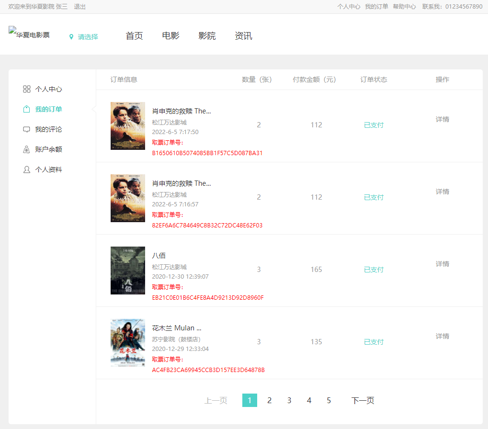
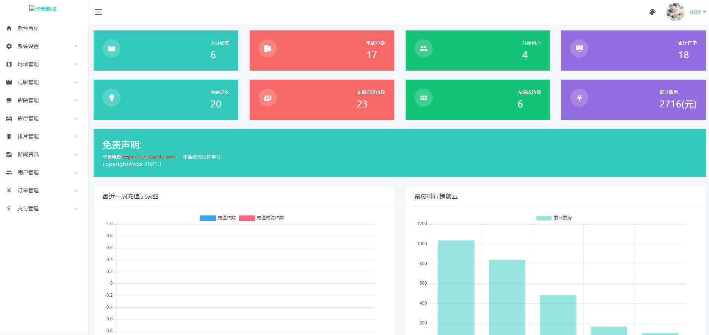
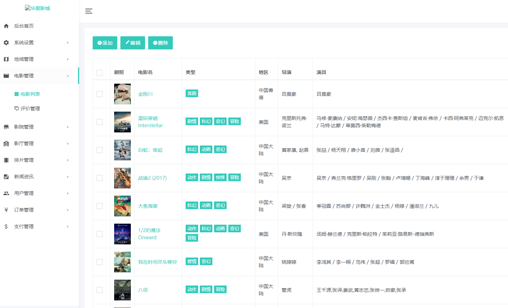
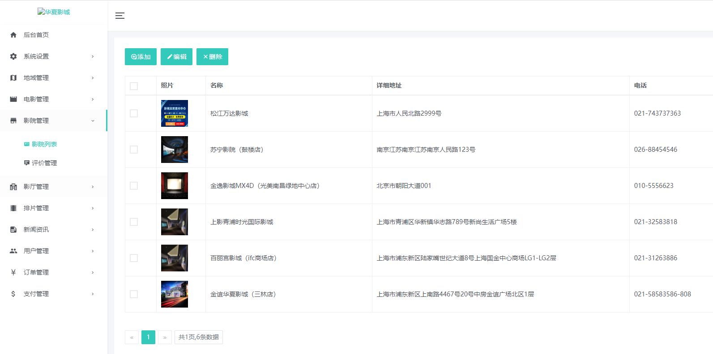
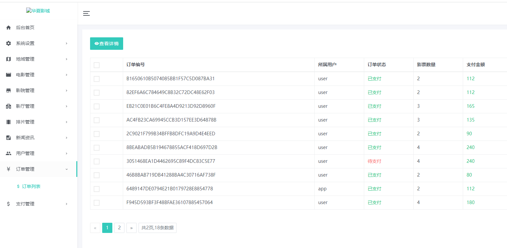

**完整代码收费  加qq  931708230 或者加微信  ynwwxid**

**接毕业设计和论文**

**博客地址：[https://blog.csdn.net/2303_76227485/article/details/128650325](https://blog.csdn.net/2303_76227485/article/details/128650325)**

**视频演示：[https://www.bilibili.com/video/BV1AP411q7RC/](https://www.bilibili.com/video/BV1AP411q7RC/)**

**毕业设计所有选题地址：[https://github.com/ynwynw/allProject](https://github.com/ynwynw/allProject)**

## 基于springboot电影购票系统(源代码+数据库)

## 一、系统介绍

- 前台
  - 普通用户注册、登录、注销
  - 用户信息修改：邮箱、密码、头像
  - 影片的信息浏览：影片的名称、导演、演员、简介及上映时间等
  - 观影的房间、座位的选择：用户选择观影的影院、房间、座位，用户不能选择已出售的座位
  - 用户的评价：用户登录后可对影片写一些评价
  - 订单信息查询：历史订单信息，包括金额、对应电影票、场次、座位等
- 后台-管理员登录
  - 对影片的信息进行管理：影片的名称、导演、演员、简介及上映时间等，对影片进行新增、删除、编辑等
  - 对影评信息进行管理：对评语进行修改、删除等。
  - 对所有电影院中影片价格进行修改
  - 对电影放映场次进行管理：增加，修改，下架场次
  - 对影院进行管理：增加修改影院
  - 对用户信息进行查询、修改等管理功能。
  - 对电影票订单信息进行查询和管理
  - 票房统计：票房数据可视化

## 二、所用技术

后端技术栈：

- springboot
- jpa
- mysql

前端技术栈：

- freemaker 

## 三、环境介绍

基础环境 :IDEA/eclipse, JDK 1.8, Mysql5.7及以上,Maven

源码+数据库脚本

所有项目以及源代码本人均调试运行无问题 可支持远程调试运行

## 四、页面截图

------------

**后台管理**

## 五、浏览地址

 前台

 地址：http://localhost:8098/home/index/index

 账号：01234567890  密码：123456

后台

地址：http://localhost:8098

账号：user  密码：123456

## 六、安装教程

1. 使用Navicat或者其它工具，在mysql中创建对应名称的数据库，并导入项目的sql文件；
2. 使用IDEA/Eclipse导入项目，若为maven项目请选择maven;
   若为maven项目，导入成功后请执行maven clean;maven install命令，然后运行；
3. 修改application.yml 里面的数据库配置
4. 启动项目后端项目 

**需要完整代码可以加qq  931708230 或者加微信 ynwwxid**

**需要完整代码可以加qq  931708230 或者加微信  ynwwxid**

